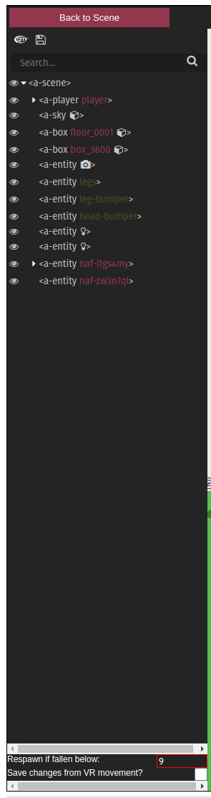

# Accelerate Editor A-Game

This is a for of [poeticAndroid/a-game](https://github.com/poeticAndroid/a-game) patched for use with the [Accelerate Editor](https://accelerate-editor.web.app/).

## Change Log

- We have the ability to `postMessage` the position of objects which are grabbed and moved whilst in VR (first-person) mode ([see line 461 of components/grabbing.js here](https://github.com/joshmurr/a-game/blob/master/src/components/grabbing.js#L461))
- If the user falls indefinitely, we can automatically respawn using the respawn limit (see below) by comparing this with the players `_vertVelocity` ([see line 188 of components/locomotion.js here](https://github.com/joshmurr/a-game/blob/master/src/components/locomotion.js#L188)).
- The above values are set in the (edited) A-Frame Inspector (at the very bottom):

